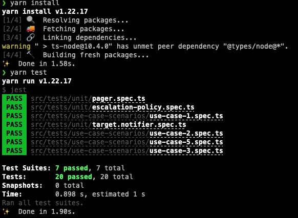

# Considerations
This solution tries to keep everything simple, thinking, for example, of the timer as a simple object in memory able to have a timeout and call the pager back.

The pros include its simplicity, but the cons are also its simplicity. It is a very naive approach, as I rarely encountered these kind of pure models outside of school projects.

## The DDD approach

My experience with DDD is somewhat limited, and also I tried to keep things simple as requested, but if we were to think in terms of DDD, I would discuss with my teammates the following considerations

### Value Objects (VOs)

Candidates for VOs would be
- Alert. An alert could easily be considered equals to another alert if both the monitored service Id and the message are equal.

- The Target classes. For the same reason, a target can be considered equal to another one (of the same type) if the recipient matches.

- Level. Given that the order of the targets is irrelevant, a level could also be considered equals to another if it contains the same targets.

### Aggregates

- Escalation Policy. We could discuss if a policy containing the same levels in the same order for the same service, could be a VO. To me, somehow, it makes sense that it would be considered an aggregate, and have a unique Id and be considered unique just by Id, regardless of the contents. One could be creating a policy that is equals to another one in a given moment of time (for example, it was cloned and pending to be edited)

### Domain Services

- Notifier. Although the diagram depicts the interaction to the MailAdapter and SMSAdapter explicitly, it makes sense to me to interact with just a single notifier that is able to decide who to invoke, who to notify. See Known Issues for more comments.


- Pager. Pager itself is a domain service to me, since it is mostly exposing to the world a way to interact with this domain. On the other hand, if it were to interact with databases, APIs, and what not, it would really be an application Service. In other architectures, perhaps several UseCase classes (one to alert, one to mark as healthy, etc)

### Bounded Context

- The whole Alert Notification System could be considered its own Bounded Context

### Anti- corruption Layers

- The adapters seem to me to be Anti.corruption Layers, decoupling the dependency of this domain from other Bounded Contexts (as it could be the Notifications BC, the Timer BC, etc)

### Domain Events

- In a DDD implementation, perhaps, I would consider sending domain events of what happened instead of invoking synchronously the timer and the notifications. A domain event could be "alert-received" with the alert as a payload.
Then, the listeners of that event could decide on what to do in that case. For example, setting a timer, notifying, etc. This would decouple the logic and allow to easily add more listeners.


---

# Known Issues

## Notifier

This implementation of notifier is not the best one, since its not taking advantage of all the polymorphism capabilities of having just "Target objects" and invoke their exposed methods. Here it is explicitly defining a switch with the two kinds. Therefore, any new target type (i.e. Slack target) would require to modify the notifier. A better approach could be a mechanism to be able to simply register targets with their adapter instance name, and let the notifier access the instance of the adapter by name (via DI container, for example)


## TimerAdapter

Thinking of the timer as a living object in memory, I decided to pass the pager instance to notify (the Alertable object). It could deal with several pagers/alertables and should know which one should be notified. As I mentioned before, this is a bit naive, since we usually would interact through a database, through a message broker such as kafka or queues such as RabbitMQ or SQS.

Then, the TimerAdapter would just, for example, send an event to a kafka, a queue or just leave it in a collection / table of the database, for a listener to know what to do, or communicate to an external API, etc. All these scenarios make more sense to me in a real-world scenario, but here we don't have that context.

This simplistic implementation brings some issues, such as distinguishing who made the call to the `pager.receive(alert)` method (or when). And making it difficult to identify when there have been several identic alerts in a row. For example, a duplicate line such as:

```
pager.receive(alert)
pager.receive(alert)
```

Not spotted during a code review and a poorly tested system

We could introduce in the alerts the concept of "creation date and time" and use it as a reference to identify if an alert was sent recently (and define what `recently` means) and then "debounce" all the alerts within the next X seconds and avoid duplicated notifications.


## Expected Guarantees from the Database

In this simplistic system design, I could expect consistency, it is: it is all using the same database "instance" and as soon as a user makes a modification to a table/collection, that modification is available to the entire system immediately.

That means that, as soon as a user sets a a system as "healthy", no more alerts are sent. If a policy is edited with new targets, the next alert is guaranteed to include all those targets, etc.

In a more complex scenario, having micro services and each one having it's own copy of the data, or just having several isolated "instances" of the database that require synching in any possible way (for example, having a SQL database with redundancy backup copies), we can expect some eventual consistency, that is, the data will take an unknown amount of time to be in sync. This time depends on the system, network latency, etc. During this time, none of the above scenarios are guaranteed, since a user could add a new target and by the time the alert is triggered again, the responsible service does not yet hold a copy of the new data.

If this considerations are important, some design decisions must be made (for example, sending all the relevant information in the payload, instead of relying on local copies or data to be already in sync)

 # Running the tests
To run the tests, simply install the dependencies of the project with

```
yarn install
```

Once it's install, you should be able to run the test by simply typing

```
yarn test
```

The output you should see should be similar to the following image


